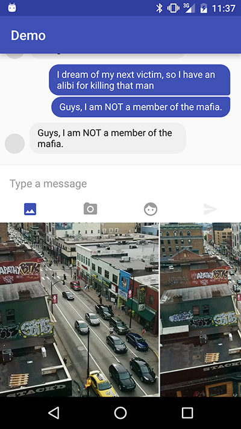

Swap
====

An EditText with the ability to swap the keyboard with custom fragments



Where to Download
-----------------
```groovy
dependencies {
  compile 'com.xlythe:swap:0.0.3'
}
```

Usage
-----
The key components are:
- SwapEditText: Loads the fragments
- FrameLayout: An empty layout for holding the fragments (Anchored at the bottom for expected results)
- Lastly, any buttons or views to trigger the switching of fragments

```xml
<com.xlythe.swap.SwapEditText
    android:id="@+id/edit_text"
    android:layout_width="match_parent"
    android:layout_height="wrap_content"/>
    
<Button
    android:id="@+id/button"
    android:layout_width="wrap_content"
    android:layout_height="wrap_content"/>
        
<!-- The default id is "container" this can be changed with setContainer(int id) -->
<FrameLayout
    android:id="@+id/container"
    android:layout_width="match_parent" 
    android:layout_height="wrap_content"/>
```

Most of the work for the keyboard is done for you. When tapping on the EditText the default keyboard is launched. You can swap out the default keyboard for any fragment of your choosing using showFragment(Fragment fragment). The library does all the measuring to match the fragment size to the size of the keyboard, enabling smooth transitioning.
```java
public class MainActivity extends AppCompatActivity {
    SwapEditText mEditText;
    
    @Override
    protected void onCreate(Bundle savedInstanceState) {
        super.onCreate(savedInstanceState);
        setContentView(R.layout.activity_main);
        
        mEditText = (SwapEditText) findViewById(R.id.edit_text);
        
        // Swap in the fragment when the button is tapped
        Button button = (Button) findViewById(R.id.button);
        button.setOnClickListener(new OnClickListener() {
            @Override
            onClick(View view) {
                mEditText.showFragment(DummyFragment.newInstance())
            }
        });
        
    }

    // Override onBackPressed in order to hide the keyboard when tapping back instead of closing the activity
    @Override
    public void onBackPressed() {
        if (mEditText.getFragmentVisibility()) {
            mEditText.hideKeyboard();
        } else {
            super.onBackPressed();
        }
    }
}
```

License
-------

    Licensed under the Apache License, Version 2.0 (the "License");
    you may not use this file except in compliance with the License.
    You may obtain a copy of the License at

       http://www.apache.org/licenses/LICENSE-2.0

    Unless required by applicable law or agreed to in writing, software
    distributed under the License is distributed on an "AS IS" BASIS,
    WITHOUT WARRANTIES OR CONDITIONS OF ANY KIND, either express or implied.
    See the License for the specific language governing permissions and
    limitations under the License.
